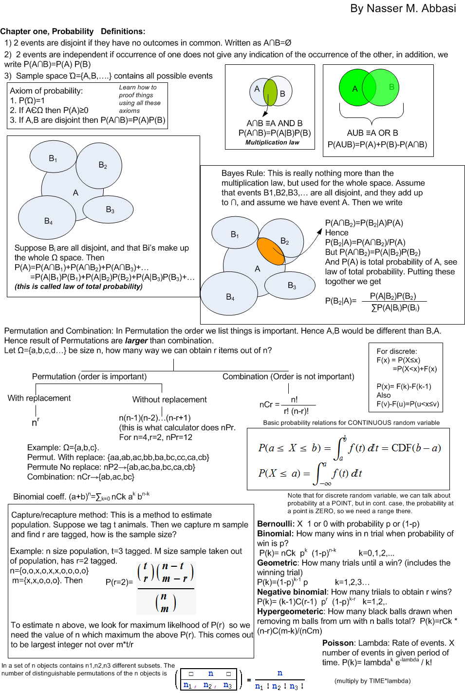
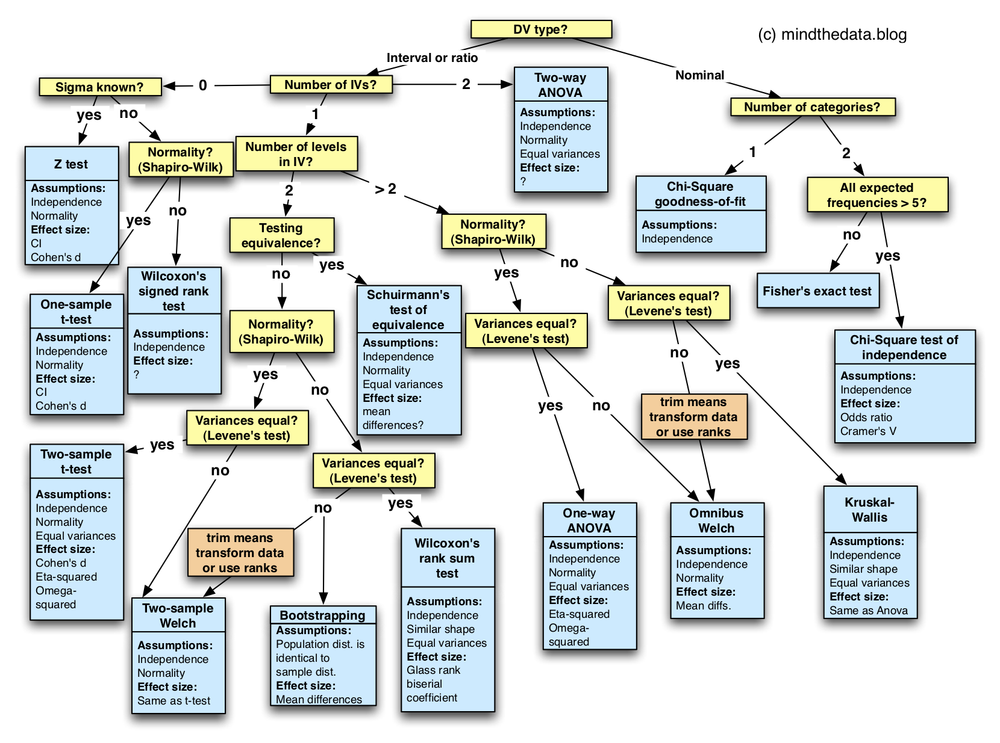
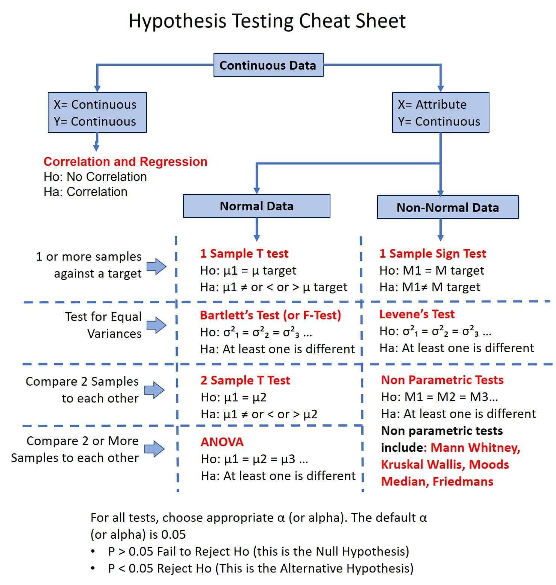
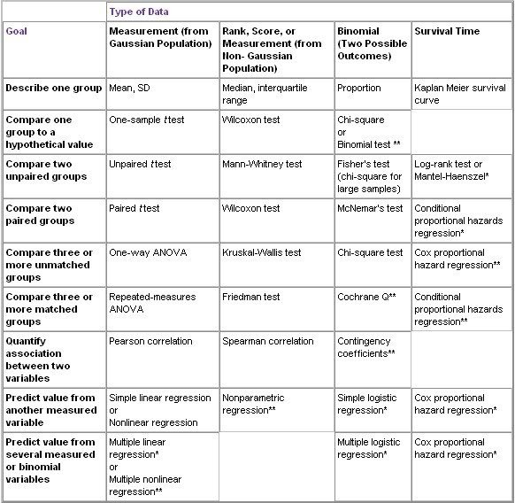
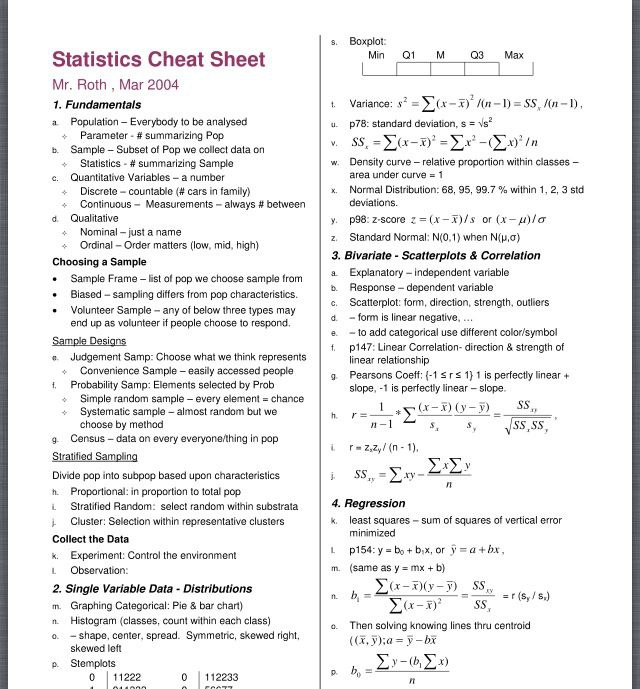
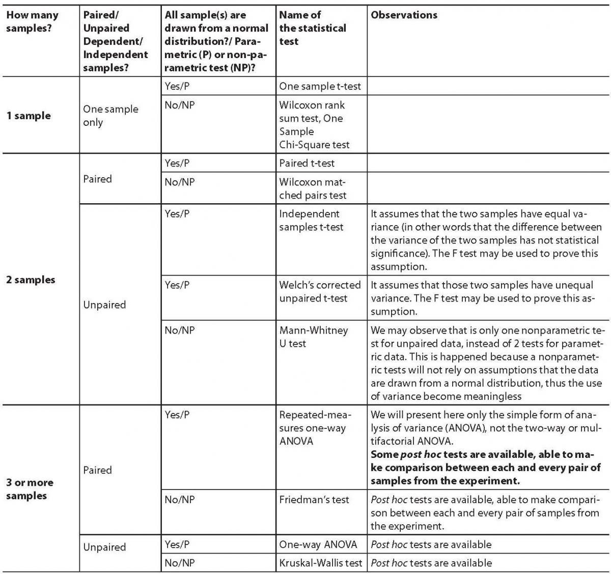
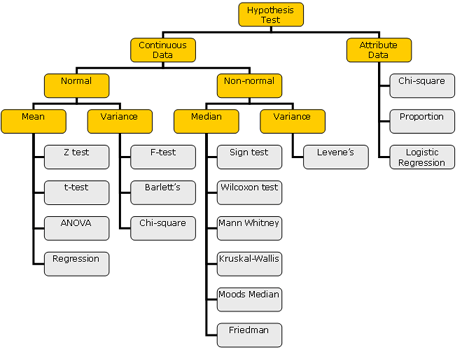

## Data Science glog

### CheatSheets:

### Statistics

### Statistics - number of groups

### Probability

### Statistics Formulas

### Selection Statistical Methods

### Statistics - data type

### Hypotesis testing

### Statistics - data type and groups

### Statistics

### Statistics - groups & normal dist

### Statistics - 

### Statistics - by words

### Statistics - Hypotesis testing

